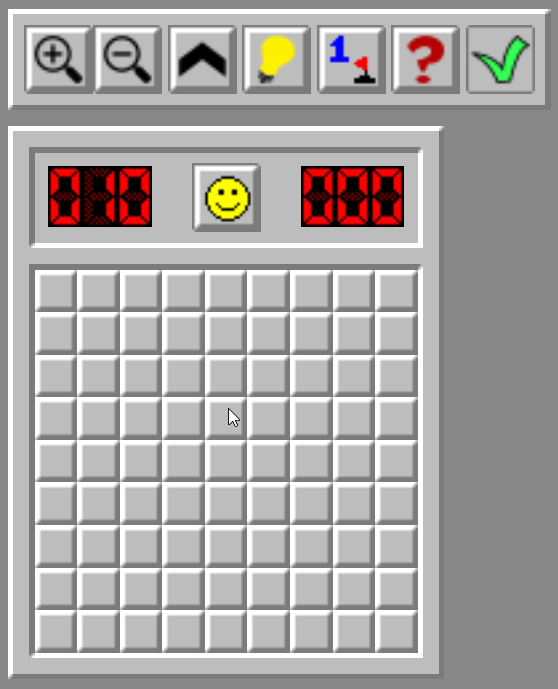
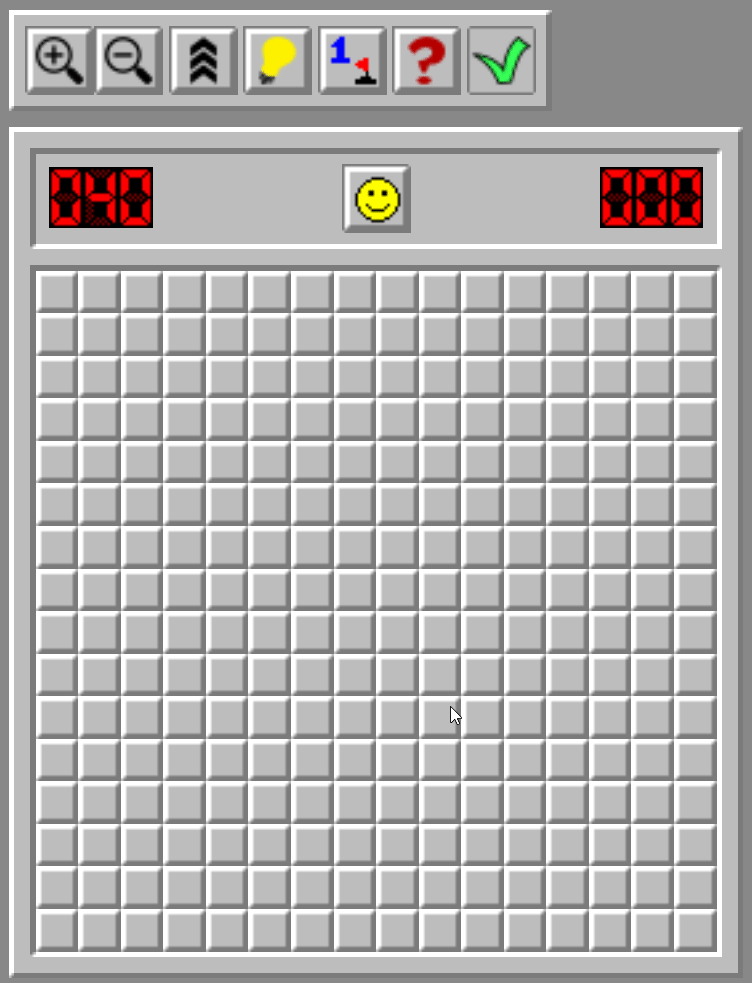

# The problem
### **Tired of playing minesweeper ?**

I have **THE** solution for you !

This bot will play any level of minesweeper in a record breaking time for you !

> __Viewer discretion is advised__ : mind blowing speeds

---
# Getting started

### First clone the repo:

    git clone https://github.com/filveith/Minesweeper-bot

### Navigate to the right folder:

    cd Minesweeper-bot/src

### Install all the dependencies (only puppeteer):

    npm i
### Run the script and enjoy

    node main.js 

If you have an error telling you that Chromium is not found / installed, go to the [chromium website](https://www.chromium.org/getting-involved/download-chromium/) and install it.

---
# More
The bot is run on [demineur.eu](https://xn--dmineur-bya.eu/)
I used **puppeteer** to scrap and interact with the website

Sometimes the bot is stuck and you can just play instead of him once and he should be able to finish the game
I am currently working on a version that wins all every game and never get's stuck

---
# 9 x 9 in 0s

--- 
# 16 x 16 in 5s

